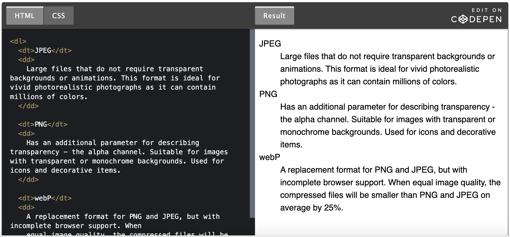

# Разметка текста

абзац

<h1 lang="fr">Заголовок</h1>
<h6>Заголовок</h6>

# Списки

<ul>
<li>маркированный (неупорядоченный) список</li>
</ul>

<ol>
<li>нумерованный (упорядоченный) список</li>
</ol>

# Ссылки

<a href="https://google.com" target="_blank" rel="noreferrer noopener">Ссылка на главную страницу Google</a>
доп атрибуты:
Ссылка на скачивание файла
<a href="/путь/к/cv.pdf" download>Скачать резюме</a>
Ссылка на телефонный номер
<a href="tel:+14251234563">+1 (425) 123-45-63</a>
Ссылка на адрес электронной почты
<a href="mailto:example@mail.ru">example@mail.ru</a>
Ссылка-якорь
<a href="#about">About</a> => <h2 id="about">About</h2>

# Кнопка

<button type="button">Открыть модальное окно</button>
по умолчанию type="submit"

# Изображения

# Изображение-ссылка

# Изображение с подписью

<figure>
  <!-- Произвольный графический контент: фотография, график, диаграмма и т. п. -->
  
  <figcaption>Текст пояснения который будет под изображением</figcaption>
</figure>

# Абсолютные и относительные пути

https://images.pexels.com/photos/583842/pexels-photo-583842.jpeg - Абсолютный путь
./images/logo.png - Относительный путь

# Таблицы

[Таблицы](https://textbook.edu.goit.global/html-css/docs/1.1/lesson-02/tables#%D1%8F%D1%87%D0%B5%D0%B9%D0%BA%D0%B8-%D0%B7%D0%B0%D0%B3%D0%BE%D0%BB%D0%BE%D0%B2%D0%BA%D0%B8)

<table> - определяет всю таблицу, контейнер для контента.
<tr> - строка таблицы (table row). Не может быть пустой, должна содержать хотя бы одну ячейку.
<td> - ячейка таблицы (table data). Можно использовать только внутри строки. В каждой строке таблицы должно быть одинаковое количество ячеек.
<th> - семантический тег ячейки-заголовка. По умолчанию текст внутри <th> выделяется жирным и центрируется.

<table>
  <tr>
    <th>Номер</th>
    <th>Маршрут</th>
    <th>Время в пути</th>
  </tr>
  <tr>
    <td>433</td>
    <td>Киев - Ковель</td>
    <td>5 часов</td>
  </tr>
  <tr>
    <td>701</td>
    <td>Харьков - Днепр</td>
    <td>7 часов</td>
  </tr>
  <tr>
    <td>258</td>
    <td>Львов - Одесса</td>
    <td>4 часа</td>
  </tr>
</table>

Секции таблицы
Для повышения семантики разметки таблицы есть несколько структурных тегов.

<thead> - шапка, оборачивает группу строк таблицы в области заголовка.
<tbody> - тело, оборачивает основную группу строк таблицы.
<tfoot> - подвал, обозначает группу строк таблицы в области нижнего колонтитула.

Заголовок таблицы

<table>
  <caption>
    Расписание поездов
  </caption>

  <!-- Остальная разметка таблицы -->
</table>

[Группировка ячеек](https://textbook.edu.goit.global/html-css/docs/1.1/lesson-02/tables#%D0%B3%D1%80%D1%83%D0%BF%D0%BF%D0%B8%D1%80%D0%BE%D0%B2%D0%BA%D0%B0-%D1%8F%D1%87%D0%B5%D0%B5%D0%BA) -

# Разметка текста

<dl></dl>
<dt></dt>
<dd></dd>

<pre></pre>

<time></time>

  Последние новости на <time datetime="2019-12-14">14 декабря 2019 года</time>.

  Заседание состоялось в <time datetime="2018-07-14T11:30">11:30 утра</time>.

<address></address>
<address>
  г. Киев,  
  Бульвар Леси Украинки, д. 26,  
  4й этаж офис 427
</address>

<address>
  <a href="mailto:mango@mail.pig">mango@mail.pig</a>
  <a href="tel:+1112223344">(111) 222-33-44</a>
</address>

<strong></strong>
Cемантически подчеркивает текст как важный и указывает, что это значимое слово или фраза
<b></b>
Делает текст только визуально жирным, привлекая внимание, но не придавая особой важности

<em></em>
Семантически выделяет текст, на который сделан особый акцент, меняющий смысл фразы. Например можно выделить сарказм
<i></i>
Делает текст только визуально курсивным, привлекая внимание, но не придавая особой важности. Например выделить термины в предложении.

# Символьные подстановки

Все права защищены &copy; Lex, 2020

Все права защищены &#169; Lex, 2020

Все права защищены &#xa9; Lex, 2020

< - &lt;
> - &gt;

# Видео

<video
src="http://techslides.com/demos/sample-videos/small.webm"
poster="https://images.pexels.com/photos/595804/pexels-photo-595804.jpeg?w=640"
width="640"
controls
autoplay
loop
preload="auto"> </video>

src - указывает адрес видеофайла
poster - адрес изображения, которое используется как постер если видео не загружено или еще не проигрывается
width и height - задают высоту и ширину как у изображения
controls - атрибут-флаг, если присутствует - добавляются элементы управления видео
autoplay - атрибут-флаг, если присутствует - проигрывание видео начинается как только оно доступно
loop - атрибут-флаг, если присуствует - видео будет повторяться в цикле

Атрибут preload указывает режим предварительной загрузки видео. Его значение влияет на то, какая иформация будет загружена. Значение по умолчанию зависит от браузера в котором была открыта веб-страница.

none - не загружать видео заранее
metadata - загрузить служебную информацию (длительность и т. п.)
auto - заранее загружать всё видео

[link](https://textbook.edu.goit.global/html-css/docs/1.1/lesson-02/media#%D0%B2%D0%B8%D0%B4%D0%B5%D0%BE)

<video
poster="https://images.pexels.com/photos/595804/pexels-photo-595804.jpeg?w=640"
width="640"
controls>

  <source
    src="http://techslides.com/demos/sample-videos/small.webm"
    type="video/webm"/>
  <source
    src="http://techslides.com/demos/sample-videos/small.mp4"
    type="video/mp4"/>
  <source
    src="http://techslides.com/demos/sample-videos/small.ogg"
    type="video/ogg"/>
</video>

# Аудио

<audio src="song.mp3" controls autoplay loop preload="auto"></audio>
src - указывает адрес аудиофайла
controls - атрибут-флаг, если присутствует - добавляются элементы управления аудио
autoplay - атрибут-флаг, если присутствует - проигрывание аудио начинается как только оно доступно
loop - атрибут-флаг, если присуствует - аудио будет повторяться в цикле
Атрибут preload указывает режим предварительной загрузки аудиофайла. Его значение влияет на то, какая иформация будет загружена. Значение по умолчанию зависит от браузера, в котором была открыта веб-страница.

none - не загружать аудио заранее
metadata - загрузить служебную информацию (длительность и т. п.)
auto - заранее загружать весь аудиофайл

<audio controls>
  <source src="song.mp3" type="audio/mp3" />
  <source src="song.ogg" type="audio/ogg" />
</audio>
